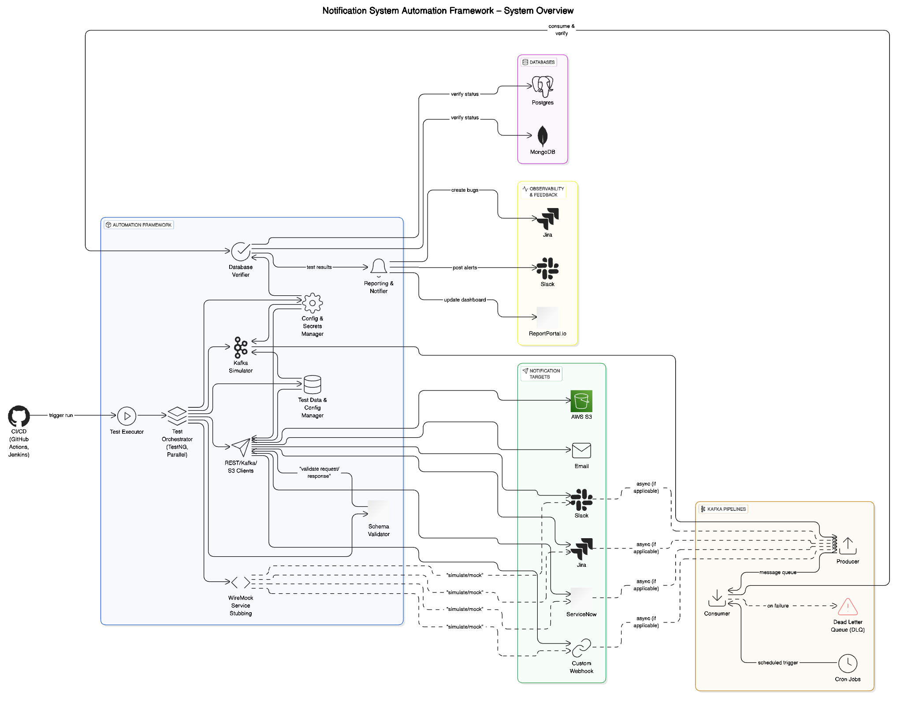

# Automation Framework Proposal for Notification System Verification

**Author:** Abhishek Singh  

---

## 📌 1. Problem Statement

We are building a comprehensive automation framework to validate a real-world Notification Dispatch System responsible for pushing notifications to multiple platforms — including Splunk, Jira, custom webhooks, AWS S3, email, and ServiceNow. The payloads are in JSON key-value format and must be reliably delivered and verified.

This document outlines the proposed architecture, design patterns, technology stack, feature set, assumptions, and a test strategy that ensures complete coverage, maintainability, and extensibility.

---

## 🏗️ 2. High-Level Architecture



### 🔍 Enhanced Explanation

Our proposed framework is designed as a **best-in-class, production-grade test automation platform** for validating a distributed notification system. Here's what sets it apart:

### ✅ Core Components and Their Functional Roles

- **Test Executor**: Triggers test suites via GitHub Actions (nightly, on-deployment, on-demand). Supports dynamic tagging and filtering.

- **Test Orchestrator**: Built using TestNG's parallel execution engine with thread-local isolation, enabling efficient test distribution with test ownership tagging via metadata.

- **Test Data & Config Manager**: Uses Typesafe `.conf` (HOCON) format to manage secure, environment-specific configs. Supports config inheritance, fallback, and override capabilities. Handles database credentials, API tokens, S3 keys, Kafka topics, etc.

- **RestUtils API Layer**: Wrapper utility layer supporting all HTTP methods with standardized logging, retry, schema validation, and reporting. Includes overloads for path/query/body parameterization.

- **WireMock Service Stubbing**: Provides contract-based simulation for third-party services like Jira, ServiceNow, or webhook endpoints.

- **Schema Validator**: Automatically validates notification payloads and responses using versioned JSON schemas stored in the `schemas/` directory.

- **Slack & Jira Notifier**: Posts execution summaries and errors to Slack channels and creates Jira bugs with assigned test owners based on annotations.

- **Kafka Simulator**: Simulates Kafka producers/consumers to verify asynchronous delivery logic.

- **Database Verifier**: JDBC-backed validation layer with connection pooling (via HikariCP) to verify post-notification status updates in real-time.

- **S3 Integration**: Custom client to verify S3-based delivery or archival of notification metadata.

---

### 🌐 Unique and Modern Features

- **Live Reporting & Dashboarding**: Integrated with [ReportPortal.io](https://reportportal.io) to provide real-time dashboards, historical trends, test ownership mapping, and rich failure analytics. This enables teams to identify flaky tests, regressions, and health trends over time.

- **Dynamic Retry Strategy** with exponential backoff and runtime overrides.

- **Distributed Parallel Execution** with complete thread-safe utilities.

- **Environment-aware Mocking and Configurations** for real-world behavior simulation.

- **Slack/Jira Integration with Test Owner Attribution** for intelligent alerting and bug triaging.

- **Kafka and Cron Simulation** with verifiable DB status tracking — replicating real distributed system design.

- **Schema Validation Ignorability** via annotation to keep test control flexible.

- **Dockerized Execution** ensures reproducibility, isolation, and CI/CD friendliness.

---

### 💡 Real-World Assumptions Incorporated

- Notifications may go through **Kafka-based pipelines**, picked up by **scheduled cron jobs/consumers**.

- Failures are tracked and retried **based on dynamic policies** before being marked in the DB.

- Notifications may include **metadata like `traceId`, `eventType`, `correlationId`**, which are validated via schema and DB correlation.

- Notification service supports different **delivery modes**: Sync (e.g., Slack), Async (e.g., Jira, ServiceNow), and Batch (e.g., S3 dump).

- Sensitive data handling is done securely via `.conf` + CI secret injection, ensuring security best practices.

- Each notification target (like ServiceNow) is **owned by a test engineer** identified via `@Author` metadata for maintainability and alert routing.


## 🧰 3. Tech Stack & Tools

| Tool | Usage |
|------|-------|
| **Java + TestNG** | Core language and test framework for modular, annotation-driven testing |
| **Maven** | Build management and dependency resolution tool with multi-module support |
| **Typesafe Config (HOCON)** | Configuration management using `.conf` files with fallback and override capabilities |
| **RestAssured + JSON Schema Validator** | REST API automation with schema validation and response chaining |
| **gRPC (grpc-java + Protobuf)** | For strongly typed gRPC service testing and stub generation |
| **WireMock** | Mocking of third-party systems for simulation of downstream dependencies |
| **Jackson** | JSON (de)serialization for request/response models and payload transformation |
| **TestNG DataProvider** | Enables parameterized testing using static and dynamic data sources |
| **AssertJ + JSONAssert** | Fluent assertion libraries for object comparison and JSON validation |
| **Slack SDK / Jira REST API** | For real-time Slack notifications and automatic Jira issue creation on test failure |
| **Docker** | Containerized test execution for reproducible, isolated runs across environments |
| **GitHub Actions** | CI/CD orchestration for nightly, post-deployment, and manual test executions |
| **JFrog Artifactory / Nexus** | Artifact repository to host build/test reports and enable integration with other pipelines |
| **ReportPortal.io** | Real-time dashboards with test trends, ownership tagging, and flaky test detection |


---

## 🧩 4. Package Structure

```
notification-framework
├── src
│   ├── main
│   │   ├── config               # .conf reader utility (Typesafe HOCON)
│   │   ├── core                 # Core engine: annotations, enums, listeners
│   │   ├── clients              # RestUtils, KafkaProducerClient, EmailClient, S3Client
│   │   ├── validators           # Schema and response validators
│   │   ├── mocks                # WireMock setup for 3rd party simulation
│   │   ├── notifications        # Platform-specific notification logic (SlackSender, JiraNotifier, etc.)
│   │   ├── pojo                 # Payload POJOs used in test input/output
│   │   ├── reporting            # ReportPortal integration classes and listeners
│   │   └── utils                # Helpers: Slack, Jira, Retry, Logging
│   └── test
│       ├── tests
│       │   ├── positive         # Success path tests
│       │   └── negative         # Negative/edge case tests
│       ├── data                 # Environment-specific test data
│       │   └── qa/data.conf
│       ├── suites               # TestNG suite files
│       │   ├── smoke-suite.xml
│       │   └── regression.xml
│       └── dataproviders        # Centralized DataProvider utilities
├── schemas                     # JSON Schemas for payload/response validation
│   ├── slack.schema.json
│   ├── servicenow.schema.json
│   └── s3.schema.json
├── slack-templates             # Slack alert JSON templates (blocks, summaries, actions)
├── suite.xml                   # Default test suite file
├── Dockerfile                  # Containerized execution support
└── README.md                   # Project setup, structure, CI/CD, contribution guide
```

---

### 🧾 Design Rationale

Our framework is designed for **modularity**, **scalability**, and **CI/CD readiness**. Below is a breakdown of the packages and their purpose:

#### 🔧 `main/`
- **`config/`**: Loads HOCON `.conf` files per environment via `ConfigManager`.
- **`core/`**: Holds base constructs like annotations (`@Author`), enums, and listeners.
- **`clients/`**: Contains API and system clients (REST, Kafka, S3, SMTP) with retry and observability logic.
- **`validators/`**: Performs schema and structural validation of payloads and responses.
- **`mocks/`**: Sets up WireMock for mocking third-party service interactions.
- **`notifications/`**: Encapsulates logic for Slack, Jira, ServiceNow using strategy interfaces.
- **`pojo/`**: Models the notification request/response structure for test execution.
- **`reporting/`**: Integrates [ReportPortal.io](https://reportportal.io) via listeners and test reporters.
- **`utils/`**: Utility classes for logging, Jira bug creation, Slack messaging, and retry strategies.

#### 🧪 `test/`
- **`tests/positive`** and **`tests/negative`**: Clear separation for regression clarity and tagging.
- **`data/`**: Static environment-specific test data in `.conf` format.
- **`suites/`**: Organized suite XMLs (`smoke`, `regression`, `feature-specific`).
- **`dataproviders/`**: Houses all reusable TestNG data providers (faker-based, dynamic, static).

#### 📦 Project Root
- **`schemas/`**: Contract-first schema validation per platform.
- **`slack-templates/`**: Predefined Slack message blocks for structured notifications.
- **`Dockerfile`**: For reproducible Docker-based execution in any environment.
- **`README.md`**: Documentation for onboarding, build setup, architecture, and CI flow.


---

## 🧠 5. Design Patterns Used

Our automation framework is thoughtfully engineered using proven design patterns to achieve **clean architecture**, **test scalability**, and **future-proofing**. Below is a curated breakdown:

---

### 🧱 Builder Pattern  
**✅ Purpose:** Construct dynamic, complex payloads using fluent, readable chaining.  
**📁 Class:** `NotificationPayloadBuilder.java`

```java
NotificationPayload payload = NotificationPayloadBuilder.builder()
    .withTitle("System Alert")
    .withMessage("ServiceNow alert triggered")
    .withTraceId(UUID.randomUUID().toString())
    .build();
```

**🎯 Why it’s used:**  
- Simplifies payload creation  
- Handles optional fields gracefully  
- Ensures immutability and test stability  

---

### 🏭 Factory Pattern  
**✅ Purpose:** Instantiate appropriate notification sender based on platform type.  
**📁 Class:** `SenderFactory.java`

```java
public class SenderFactory {
    public static NotificationSender getSender(String platform) {
        return switch (platform.toLowerCase()) {
            case "slack"      -> new SlackSender();
            case "jira"       -> new JiraSender();
            case "servicenow" -> new ServiceNowSender();
            default           -> throw new IllegalArgumentException("Unsupported platform: " + platform);
        };
    }
}
```

**🎯 Why it’s used:**  
- Clean separation of instantiation logic  
- Easy to add support for new platforms  
- Encourages Open/Closed Principle  

---

### 🔁 Strategy Pattern  
**✅ Purpose:** Apply various retry mechanisms (fixed, exponential, custom) in a flexible way.  
**📁 Classes:** `RetryStrategy`, `ExponentialBackoffStrategy`

```java
public class ExponentialBackoffStrategy implements RetryStrategy {
    public void execute(Runnable action) {
        int retries = 3;
        for (int i = 0; i < retries; i++) {
            try {
                action.run();
                return;
            } catch (Exception e) {
                Thread.sleep((long) Math.pow(2, i) * 1000);
            }
        }
    }
}
```

**🎯 Why it’s used:**  
- Modular retry policies  
- Promotes encapsulation  
- Flexible and plug-and-play

---

### 🔒 Singleton Pattern  
**✅ Purpose:** Provide centralized, one-time-loaded configuration access across tests.  
**📁 Class:** `ConfigManager.java`

```java
public class ConfigManager {
    private static final ConfigManager INSTANCE = new ConfigManager();
    private Config config = ConfigFactory.load("qa/data.conf");

    private ConfigManager() {}

    public static ConfigManager getInstance() {
        return INSTANCE;
    }

    public Config getConfig() {
        return config;
    }
}
```

**🎯 Why it’s used:**  
- Ensures global consistency  
- Saves memory and avoids redundant loading  
- Thread-safe and CI-ready

---

### 👀 Observer Pattern 
**✅ Purpose:** Hook into test lifecycle events to trigger alerts or custom actions.  
**📁 Proposed Class:** `TestExecutionListener.java`

```java
public interface TestExecutionListener {
    void onTestStart(TestContext context);
    void onTestFailure(TestContext context);
    void onTestSuccess(TestContext context);
}
```

**🎯 Why to consider:**  
- Enables decoupled test alerting (Slack, Jira)  
- Paves way for audit/event logs  
- Aligns with event-driven architecture

---

### 🧵 ThreadLocal Pattern   
**✅ Purpose:** Ensure thread-safe usage of reusable objects during parallel test execution.  
**📁 Class:** `ThreadSafeRestClient.java`

```java
public class ThreadSafeRestClient {
    private static final ThreadLocal<RestClient> client = ThreadLocal.withInitial(RestClient::new);
    
    public static RestClient getClient() {
        return client.get();
    }
}
```

**🎯 Why to consider:**  
- Prevents cross-thread data collisions  
- Enables reliable parallel execution  
- Critical for stable CI pipelines

---

### 📊 Summary Table

| 🧩 Pattern           | 🎯 Purpose                                 | 📁 Applied In                                |
|---------------------|---------------------------------------------|----------------------------------------------|
| **Builder**          | Dynamic payload construction               | `NotificationPayloadBuilder`                 |
| **Factory**          | Notification sender instantiation          | `SenderFactory`                              |
| **Strategy**         | Retry mechanism abstraction                | `RetryStrategy`, `ExponentialBackoffStrategy`|
| **Singleton**        | Config/client reuse                        | `ConfigManager`, `KafkaClient`               |
| **Observer** *(★)*   | Lifecycle-driven integrations              | `TestExecutionListener`          |
| **ThreadLocal** *(★)*| Thread-safe execution in parallel CI       | `ThreadSafeRestClient`        |


---

✅ These patterns make the framework **robust**, **modular**, and **easily maintainable**, ensuring it scales with evolving team size and feature complexity.


---

## 🔒 6. Secrets & Config Management

Managing sensitive data and environment-specific configurations is a key pillar of our test framework. We’ve implemented a **robust, secure, and extensible configuration model** using [Typesafe Config (HOCON)](https://github.com/lightbend/config) files.

---

### 🔐 Key Principles

- **Environment-based configuration**: Supports QA, staging, and production via `test-data/{env}/data.conf`.
- **Secrets injection**: Uses `${?ENV_VAR}` syntax to securely inject tokens, passwords, and sensitive URLs.
- **Runtime flexibility**: Easily override environment at runtime via `-Denv=qa`.
- **Modular service configs**: Each service (like Notification, Kafka, Mongo) has its own config block for better maintainability.

---

### 📦 Example: `notification_dispatch_service.conf`

```hocon
notification_dispatch_service {
  baseUrl = "https://notification.test.zeptonet.io/api"
  host = "notification.test.zeptonet.io"

  kafka {
    broker = "b-1.kafka.notification.io:9092,b-2.kafka.notification.io:9092"
  }

  mongo {
    host = "notification-db-uat:xpass@notification.mongodb.net/"
    name = "notificationService"
    port = 27017
    replicaSet = "atlas-ntfshard-0"
  }

  port = 443
}
```

---

### 📘 Sample: API Endpoints for Notification Platform

All API paths are stored in `.conf` under service-specific domains. This avoids hardcoding, enhances reusability, and makes test cases more readable.

```hocon
notification_endpoints {
  send_slack_notification     = "/v1/notify/slack"
  send_email_notification     = "/v1/notify/email"
  send_servicenow_ticket      = "/v1/notify/servicenow"
  notify_splunk_dashboard     = "/v1/notify/splunk"
  s3_metadata_upload          = "/v1/notify/s3-upload"
  heartbeat_check             = "/v1/system/health"
  fetch_notification_status   = "/v1/notify/status/{notification_id}"
}
```

---

### ✅ Benefits & Innovation

| Feature | Description |
|--------|-------------|
| 🔒 Secure | Tokens/secrets injected at runtime, not hardcoded |
| 🔁 Reusable | API endpoints, DB settings reused across tests |
| 🌍 Multi-Env | Supports QA, Staging, Prod via `-Denv` flag |
| 🧩 Modular | Config is service-scoped: easily maintainable |
| ⚙️ CI-Ready | Compatible with GitHub Actions/Jenkins secret injection |

---

> 🧠 This configuration strategy ensures our automation framework is **secure**, **flexible**, and **production-aligned** — ideal for testing distributed systems like the Notification Dispatch Service.


---

## 🔁 7. Dynamic Retry Logic

Robust automation requires smart retry mechanisms to handle intermittent failures gracefully — especially when dealing with unstable third-party services or delayed asynchronous systems (like Kafka, ServiceNow).

### 🔧 Features & Capabilities

- **Runtime configurable retry count** via `-Dretry.count=3`
- **Exponential backoff strategy** by default
- **Fallback to safe defaults** if config is missing
- **Retry block accepts any `Runnable` logic** — can wrap API calls, DB operations, or mocks

---

### 🛠️ Configuration Example (HOCON)
```hocon
retry {
  count = 3
  strategy = "exponential"
}
```

---

### 🧠 Java Implementation Snippet

```java
public class RetryHandler {
    private final int retryCount;

    public RetryHandler(int retryCount) {
        this.retryCount = retryCount;
    }

    public void execute(Runnable task) {
        for (int attempt = 1; attempt <= retryCount; attempt++) {
            try {
                task.run();
                return; // Success
            } catch (Exception e) {
                if (attempt == retryCount) throw e;
                Thread.sleep((long) Math.pow(2, attempt) * 1000); // Exponential backoff
            }
        }
    }
}
```

---

### ✅ Why This Design Works

| Feature | Benefit |
|--------|---------|
| 🔁 Retry as a utility | Can be reused across REST, Kafka, DB, Mock verification |
| 🔧 Configurable | Retry count and strategy are configurable per environment |
| 💥 Fails gracefully | Stops after N attempts and reports meaningful errors |
| 🔒 Safe | No state is shared, thread-safe design |

---

> This makes the retry mechanism **highly pluggable**, **CI/CD-safe**, and **ideal for distributed and flaky system testing**.

---

## 📣 8. Slack & Jira Integration

We’ve implemented **smart, metadata-driven reporting** via Slack and Jira for fast feedback and actionable test insights.

### 🔧 Features

- **Auto-notify failures** with test metadata in Slack
- **Auto-create Jira bugs** tagged with responsible author
- **Environment-aware** reporting (e.g., QA vs Staging alerts)
- **Test-level authorship annotation** using `@Author`
- **Centralized Slack formatting with block templates**
- **Slack & Jira logic abstracted into `SlackNotifier`, `JiraReporter`**

---

### 🔖 Example Annotation Usage

```java
@Test(description = "Test ServiceNow Notification", groups = {"servicenow"})
@Author("abhishek.singh")
public void testServiceNowFlow() {
    // test logic
}
```

---

### 🔗 Slack Notification Sample Block (Template Format)

```json
{
  "blocks": [
    {
      "type": "section",
      "text": {
        "type": "mrkdwn",
        "text": "*❌ Test Failure: ServiceNow Notification*\n*Suite:* Regression\n*Env:* QA\n*Owner:* @abhishek.singh"
      }
    },
    {
      "type": "actions",
      "elements": [
        {
          "type": "button",
          "text": {
            "type": "plain_text",
            "text": "View Report"
          },
          "url": "https://reportportal.zeptonet.io/launch/789"
        }
      ]
    }
  ]
}
```

---

### 📌 Jira Integration Flow

1. On test failure, listener extracts metadata like `@Author`, test name, env, and error trace.
2. Jira ticket is auto-created under appropriate project (e.g., QA-AUTO).
3. Jira summary includes test name + environment; description includes error trace + Slack link.

---

### ✅ Benefits

| Feature | Benefit |
|--------|---------|
| 🔔 Instant Feedback | Team gets real-time visibility into regressions |
| 🧑‍💻 Author Mapping | Easy root cause assignment using metadata |
| 📦 Slack Templates | Structured formatting and consistent messages |
| 🐞 Automated Jira | Reduces manual bug filing effort |
| 🚀 CI/CD Compatible | Works seamlessly across local and pipeline runs |

---

> This integration makes our framework **highly visible**, **actionable**, and **developer-friendly**, encouraging test ownership and faster debugging.


## 🧪 9. Test Data & Payload Management

A scalable automation framework requires a hybrid test data strategy — combining static, dynamic, and runtime-chained data for maximum test coverage, traceability, and reusability.

---

### 🧰 Features & Design Strategy

- **Static Test Data**: Stored in HOCON `.conf` files (`test-data/qa/data.conf`)
- **Dynamic Test Data**: Generated on the fly using the `faker` library
- **Data Chaining**: Use API responses as input for dependent flows
- **POJO + Builder**: Test data mapped using Java POJOs via Builder pattern
- **Test Data Helpers**: Reusable helper classes construct payloads with mixed data sources

---

### 🧠 Example: Dynamic Payload Construction

```java
NotificationPayload payload = NotificationPayloadBuilder.builder()
    .withTitle("Test Alert")
    .withMessage(faker.lorem().sentence())
    .withEventId(UUID.randomUUID().toString())
    .withEnvironment(ConfigManager.getInstance().get("env"))
    .build();
```

This ensures that:
- Faker generates test-specific, non-repetitive data
- Static values come from `.conf`
- Runtime metadata is auto-injected (e.g., `env`, `experiment_id`)

---

### 🧩 Where Data Lives

- Static config → `test-data/{env}/data.conf`
- Payloads → `pojo/` package using builders
- Builders → `NotificationPayloadBuilder`, `SlackRequestBuilder`, etc.
- Data helpers → `TestDataHelper.createSlackPayload()` (abstracts mixed data source construction)

---

## 📐 10. Schema Validation

Schema validation is **automatically enforced** at test runtime using pre-versioned JSON schemas.

---

### 🧰 Features & Mechanics

- JSON schema files reside in `schemas/` directory
- Each response body is validated against corresponding schema
- Supports versioned validation (e.g., `slack.schema.v1.json`)
- Auto-bypassed via annotation for specific test scenarios
- Uses `com.github.fge:json-schema-validator` under the hood

---

### 🧠 Example: Schema Validation in Action

```java
@Test(description = "Validate Slack Notification Schema")
public void testSlackSchemaValidation() {
    Response response = slackSender.send(payload);
    SchemaValidator.validate("slack.schema.json", response.getBody().asString());
}
```

---

### 🙅 Skip Schema Validation (Negative or Error Flow)

Use `@NoSchemaValidation` at method level to skip validation intentionally:

```java
@Test
@NoSchemaValidation
public void testInvalidSchemaNotValidated() {
    Response response = webhookSender.send(malformedPayload);
    // Only status/assertion checked here
}
```

---

### 📛 On Schema Failure — Log Output Example

```
Schema Validation Failed: slack.schema.json
Error: $.message: expected type: String, found: Null
Error: $.traceId: required property is missing
```

This helps teams debug test data gaps or backend changes instantly.

---

### 🔍 Response Validation Against DB

Some validation (e.g., async notification status) happens via DB lookups.

- For Mongo → Uses MongoDB Java Driver with HikariCP connection pooling
- For Postgres → Uses JDBC-backed DAO classes and `DataVerifier.validateFromDb(...)`

```java
// Mongo Example
boolean isAcked = mongoHelper
    .findByTraceId(payload.getTraceId())
    .get("status")
    .equals("acknowledged");

// PostgreSQL Example
Assert.assertEquals(
    pgDao.getNotificationStatus(payload.getTraceId()), 
    "ACK"
);
```

---

### ⏱️ Async Validations via Awaitility

To validate eventually consistent systems (e.g., Kafka → DB updates), we use **Awaitility**:

```java
Awaitility.await()
    .atMost(Duration.ofSeconds(20))
    .pollInterval(Duration.ofSeconds(2))
    .until(() -> 
        mongoHelper.findByTraceId(payload.getTraceId())
                   .get("status")
                   .equals("delivered")
    );
```

✅ Benefits:
- Polls in intervals
- Avoids Thread.sleep
- Ideal for async, queue-based flows

---

### ✅ Summary Benefits

| Capability | Benefit |
|-----------|---------|
| 🔁 Mixed Data Strategy | Combine faker + static + API chaining |
| 🧱 Payload Builders | Reuse payload structure logic via POJOs |
| 📁 Organized Configs | Data per env stored under `test-data/qa/` |
| 🔐 Schema Guardrails | Contracts enforced automatically |
| 🙅 Opt-Out Friendly | Bypass validation for negative scenarios |
| 🧪 Async-Safe | Uses Awaitility for queue/cron-based flows |
| 🔍 DB Verification | Ensures true E2E flow — backend state validated |

---

> This strategy makes our test suite **real-world ready**, **resilient**, and **extensible**, helping simulate any notification workflow scenario across channels and failures.


## ✅ 11. Positive & Negative Test Flows

Testing a distributed notification platform requires strong test design principles: **parameterization**, **test isolation**, **negative scenario handling**, and **async verification** — all baked into our framework.

---

### 🧪 Test Design Strategy

- ✔️ **Positive Flows**: Validate schema, response code, backend state
- ❌ **Negative Flows**: Trigger retries, schema rejections, validation errors
- 🔄 **Async Cases**: Use Awaitility for eventual backend validation
- ⚙️ **Thread-safe Execution**: Isolated payloads, no shared state, parallel-safe

---

### 📌 DataProvider Example

```java
@DataProvider(parallel = true)
public Object[][] notificationDataProvider() {
  return new Object[][] {
    { "validSlackPayload", true },
    { "invalidPayload", false },
    { "unsupportedPlatform", false }
  };
}
```

---

### 🧠 Full Test Case

```java
@Test(dataProvider = "notificationDataProvider")
@Author("abhishek.singh")
public void testSlackNotification(String type, boolean expected) {
    NotificationPayload payload = TestDataHelper.getPayloadByType(type);
    NotificationSender sender = SenderFactory.getSender("slack");
    Response response = sender.send(payload);

    if (expected) {
        SchemaValidator.validate("slack.schema.json", response.getBody().asString());
        Assert.assertTrue(response.isSuccess());
    } else {
        Assert.assertFalse(response.isSuccess());
    }
}
```

---

### ✅ Why This Works

| 🎯 Feature            | ✅ Benefit                                              |
|----------------------|----------------------------------------------------------|
| `@DataProvider`      | Supports scalable, DRY test variations                   |
| Builder Pattern       | Readable, reusable payload construction                  |
| Test Isolation        | Thread-safe via thread-local context & no shared state  |
| DB + Schema Check     | End-to-end positive flow validation                      |
| Awaitility Support    | Ideal for Kafka + DB async verification                  |

---

## 🔍 12. Mocking External Systems (WireMock)

To validate interactions with external platforms (e.g., Jira, ServiceNow), we use **WireMock** for HTTP simulation — fully embedded into our framework.

---

### 🔧 How We Use It

- 🌐 Simulates entire API behavior (status, body, delay)
- 🧪 Used for **positive**, **negative**, and **chaos** testing
- 🔄 Starts via `MockServerHelper` in `@BeforeSuite`

---

### ✅ Positive Mock Example

```java
@BeforeSuite(alwaysRun = true)
public void setupMocks() {
    wireMockServer.start();
    stubFor(post(urlEqualTo("/jira"))
      .willReturn(aResponse()
        .withStatus(200)
        .withBody("{\"status\":\"success\"}")));
}
```

---

### ⚠️ Negative Mock Example

```java
stubFor(post(urlEqualTo("/jira"))
  .willReturn(aResponse()
    .withStatus(500)
    .withFixedDelay(3000)
    .withBody("{\"error\":\"Internal Server Error\"}")));
```

---

### 🔒 What WireMock Should *Not* Be Used For

| 🚫 Misuse Scenario                  | ❌ Why Not                                               |
|------------------------------------|----------------------------------------------------------|
| Validating business logic          | It's just a mock — not your real service logic          |
| Hardcoded startup in test methods  | Breaks test modularity — use `@BeforeSuite`             |
| Validating downstream database writes | Use real DBs or mocks, not WireMock                    |

---

### ✅ WireMock Advantages

| 🌟 Feature           | 🔥 Value                                             |
|---------------------|------------------------------------------------------|
| Fast feedback        | No 3rd-party dependency required                    |
| Deterministic tests  | Responses are predictable and reproducible          |
| Chaos testing        | Easily simulate latency/timeouts/failures           |

---

## 🌐 13. REST API Layer (RestUtils)

A centralized, extensible HTTP layer simplifies API testing across all services — Slack, Jira, S3, Email, ServiceNow — while enforcing DRY principles and consistency.

---

### ⚙️ Features of `RestUtils`

- Supports **all HTTP methods**: GET, POST, PUT, PATCH, DELETE
- Auto-injects **base URI, content type, headers**
- Handles **path/query/body** param abstraction
- Logs **cURL + request/response** for debugging

---

### 🧠 Example: Generic POST Call

```java
public static Response post(String apiPath, Object payload) {
    return given()
        .baseUri(ConfigManager.getInstance().get("notification_dispatch_service.baseUrl"))
        .contentType(ContentType.JSON)
        .body(payload)
        .when()
        .post(apiPath)
        .then()
        .extract()
        .response();
}
```

---

### ✅ Real Usage in Tests

```java
Response response = RestUtils.post("/v1/notify/slack", slackPayload);
Assert.assertEquals(response.statusCode(), 200);
```

---

### 🏆 Benefits Summary

| 🔧 Capability     | 💡 Value                                               |
|------------------|--------------------------------------------------------|
| DRY Interface     | API logic is reusable across all notification types   |
| Debuggable Output | Full logs + curl commands on failure                   |
| CI-Ready          | Compatible with parallel/local/containerized execution|

---

> Combined, these test strategies + mocking utilities + API abstractions form the backbone of a resilient, extensible, and CI/CD-ready test automation framework for validating notification workflows.


## ⚙️ 14. Parallel Execution Support

For a scalable, fast-running, and CI-friendly test framework, **parallel execution** is critical. Our TestNG-based test suite supports high-concurrency execution with robust thread safety and dynamic suite control.

---

### 🔄 Key Features

- ✅ **Parallel Execution at Suite/Class/Method Level**
- 🧵 **Thread-safe Payloads, Clients, and Loggers** via `ThreadLocal`
- 💡 **No Static Shared State** — all payloads and configs built per thread
- 📁 **Environment-based Suite Configurations** using TestNG XMLs

---

### ⚙️ How We Achieve Safe Parallelism

| 🧩 Component           | 💡 Strategy                                               |
|------------------------|-----------------------------------------------------------|
| Payload Builders        | Immutable, thread-local instances per test               |
| `RestClient`/`KafkaClient` | Stored using `ThreadLocal` singleton pattern            |
| Config Access           | Singleton `ConfigManager`, but data is read-only         |
| Retry Handlers          | Scoped to each test thread                               |
| Logging Context         | Per-thread log enrichment with traceId/session info      |

---

### 🧠 Sample TestNG XML (Parallel by Tests)

```xml
<suite name="NotificationSuite" parallel="tests" thread-count="5">
  <test name="Slack Tests">
    <classes>
      <class name="tests.positive.TestSlackNotification"/>
      <class name="tests.negative.TestSlackFailureFlows"/>
    </classes>
  </test>
  <test name="ServiceNow Tests">
    <classes>
      <class name="tests.positive.TestServiceNowNotification"/>
      <class name="tests.negative.TestServiceNowFailures"/>
    </classes>
  </test>
</suite>
```

---

### 📦 Example: Categorizing by Groups (Smoke, Sanity, Regression)

```xml
<suite name="SanitySuite" parallel="methods" thread-count="4">
  <test name="SmokeTests">
    <groups>
      <run>
        <include name="smoke"/>
      </run>
    </groups>
    <classes>
      <class name="tests.notification.NotificationSanityTests"/>
    </classes>
  </test>
</suite>
```

🔹 Add `@Test(groups={"smoke"})` to your test methods to include them in the targeted group suite.

---

### 🧪 Real-World Usage Scenarios

| 🏗️ Use Case             | 🧩 Strategy Used                                      |
|--------------------------|------------------------------------------------------|
| CI Nightly Regression     | Run full `regression.xml` suite (parallel by test)  |
| PR Validation (Fast)      | Run `smoke.xml` suite (parallel by class or method) |
| On-Demand Local Debugging | Run individual test files (parallel off)            |
| Channel-Based Validation  | Slack/Jira/Email test groups defined via XML        |

---

### ✅ Best Practices

- ⚠️ Avoid shared statics — use `ThreadLocal` for all mutable test data
- 🧩 Split test classes by logical grouping (positive, negative, async)
- 🚀 Start with `thread-count=3` and scale based on system capacity
- 🔄 Retry failed test runs using TestNG’s `<listeners>` and rerun logic
- 🧪 Use `parallel="methods"` only when all test methods are fully isolated

---

### 🧩 What This Enables

| 🚀 Capability              | ✅ Benefit                                           |
|---------------------------|------------------------------------------------------|
| Parallel pipelines         | Fast execution, reduced CI time                     |
| Group-based suite control  | Fine-grained smoke/sanity/regression targeting      |
| Dynamic execution          | Tests taggable via CLI or Jenkins job params        |
| Fail-fast handling         | Runs stop if critical smoke tests fail              |
| Developer speed            | Faster feedback loop while debugging or enhancing   |

---

> 💡 With this strategy, our test execution model is **modular**, **thread-safe**, and **optimized for scale**, supporting modern CI/CD pipelines with speed, safety, and simplicity.


## 📄 15. Foundational Assumptions for Notification System Validation

Designing an automation framework for a **multi-channel, distributed Notification Dispatch System** requires clear, realistic assumptions that mirror how production systems behave. Below is a structured set of technical and architectural assumptions — each tightly integrated into the framework’s design choices.

---

### 🧱 Core System Assumptions

| 🔧 Domain                 | 🌐 Assumption                                                                 |
|--------------------------|------------------------------------------------------------------------------|
| **Notification Flow**     | All events are **pushed to Kafka topics**, and picked up by **cron jobs or stream consumers** |
| **Delivery Model**        | Notifications are **asynchronous** — dispatched in background without blocking the request thread |
| **Retry Policy**          | Failed deliveries are retried **N times**, with **configurable retry strategy (exponential, fixed)** |
| **Schema Governance**     | Payloads are **JSON-based**, and schema versions (e.g., `v1`, `v2`) evolve independently per channel |
| **Error Management**      | After final retry, messages are **moved to a DLQ** or marked `FAILED` in DB for manual triage |
| **Target Channels**       | Supported targets include **Slack, Jira, Email, Webhooks, AWS S3, ServiceNow**, each with custom payloads |
| **Audit & Observability** | All requests/responses are **logged with traceId + timestamp**, with DB records for verification |
| **Ownership Model**       | Each channel has a **designated QA/test owner**, auto-tagged in alerts via `@Author` annotation |
| **Secrets & Credentials** | Secrets (tokens, brokers, DB URIs) are **injected securely** via environment-based `.conf` files |
| **Test Control**          | Smoke/Sanity/Regression execution is controlled via **TestNG groups and suite.xml configurations** |

---

### 🔁 How the Framework Aligns With These Assumptions

| 🎯 System Assumption         | 🔩 Framework Design That Supports It                               |
|-----------------------------|---------------------------------------------------------------------|
| Kafka + Cron Consumers       | Uses `Awaitility` to validate eventual DB updates for async flow    |
| Retry Policy                 | `RetryHandler` supports config-driven retry with exponential backoff |
| Schema Versioning            | JSON schemas stored per version in `/schemas/`, validated on test run |
| Ownership Model              | `@Author("name")` tags used for Slack alert routing and Jira filing |
| DLQ/Failure Flow Simulation  | WireMock used to simulate timeouts, retries, and 5xx errors         |
| DB Validations               | Mongo/Postgres integration using DAO classes with HikariCP pooling  |
| Config Isolation             | `.conf` files loaded via `ConfigManager` per env (`qa`, `stage`, `prod`) |
| Multi-channel Test Strategy  | Tests are grouped per target (e.g., `slack`, `jira`) via XML groups |

---

### ✨ Framework-Level Enhancements Driven by Assumptions

- 🔁 **Pluggable Retry Logic** with runtime overrides (`-Dretry.count`)
- 🧪 **Schema Validation** with skip annotation support (`@NoSchemaValidation`)
- 🧵 **Thread-safe Execution** using `ThreadLocal` for all test clients and payloads
- 📊 **ReportPortal.io Integration** to track flaky retries, test trends, execution history
- 📦 **Mock Isolation** using WireMock with contract-based mocks for each 3rd party

---

### 💼 Practical Example: Slack Notification Test Flow

1. Notification payload is sent via `RestUtils.post()` to `/v1/notify/slack`
2. WireMock simulates 200 OK or 500 failure based on test type
3. On async flow: Awaitility waits for DB to reflect `"delivered"` status
4. Schema is validated against `slack.schema.v1.json`
5. Slack alert auto-tags `@Author` and adds report URL
6. If failure: test auto-retries (if applicable), and Jira is created with failure trace

---

### ✅ Why These Assumptions Matter

| 📌 Purpose                 | 💡 Benefit to Framework & Reviewers                                     |
|---------------------------|--------------------------------------------------------------------------|
| 🌍 Production Realism       | Aligns automation with how systems behave in the wild                   |
| 🔁 Robust Failure Handling  | Enables retry, DLQ, schema bypass, async DB validations                  |
| 🎯 Traceability & Triage    | Slack/Jira integration, traceId tagging, real-time observability         |
| 🧩 Maintainability          | Schema versioning, test ownership, mock reusability across pipelines     |
| 🚀 Scalability              | Parallel-safe, cloud-executable, supports microservice-based expansion   |

---

> 🧠 These foundational assumptions not only ensure our framework simulates **real-world notification system behaviors**, but also position it for **enterprise-grade stability**, **CI/CD integration**, and **team-wide test ownership**.


## 🚀 16. CI/CD Integration: GitHub Actions + Jenkins

Our framework integrates seamlessly with **GitHub Actions** and **Jenkins** to enable fast, flexible, and fully automated test execution across development, staging, and pre-production environments.

---

### 🎯 Goals of CI/CD Integration

- 🧪 Trigger automated test runs on deployment, pull request, or manually
- 🔁 Support parameterized test execution across different suites/environments
- 🧵 Ensure secure, isolated, parallel execution via threading + environment configs
- 📦 Generate reports, retry failures, and send real-time Slack/Jira alerts

---

### 📋 Common Runtime Parameters

| 🔧 Parameter      | 🎯 Purpose                               | Example Value        |
|------------------|-------------------------------------------|----------------------|
| `env`            | Target environment configuration          | `qa`, `staging`      |
| `suiteXml`       | Select specific TestNG suite              | `smoke-suite.xml`    |
| `retry.count`    | Max retry attempts for transient failures | `2`                  |
| `thread.count`   | Number of threads for parallelism         | `4`                  |
| `report.enable`  | Enable ReportPortal integration           | `true` / `false`     |

---

### 🔧 GitHub Actions Workflow (Sample)

```yaml
name: 🚀 Notification Framework CI

on:
  workflow_dispatch:
    inputs:
      env:
        description: 'Test Environment'
        required: true
        default: 'qa'
      suiteXml:
        description: 'TestNG Suite XML'
        required: true
        default: 'regression.xml'

jobs:
  run-tests:
    runs-on: ubuntu-latest

    steps:
      - name: Checkout Repository
        uses: actions/checkout@v3

      - name: Setup Java & Maven
        uses: actions/setup-java@v3
        with:
          java-version: '17'

      - name: Execute TestNG Suite
        run: |
          mvn clean test \
            -DsuiteXmlFile=${{ github.event.inputs.suiteXml }} \
            -Denv=${{ github.event.inputs.env }} \
            -Dretry.count=3 \
            -Dthread.count=4

      - name: Upload Test Reports
        uses: actions/upload-artifact@v2
        with:
          name: test-reports
          path: test-output/
```

---

### ⚙️ Jenkins Declarative Pipeline (Sample)

```groovy
pipeline {
  agent any
  parameters {
    choice(name: 'ENV', choices: ['qa', 'staging'], description: 'Target Environment')
    string(name: 'SUITE', defaultValue: 'smoke-suite.xml', description: 'Test Suite')
    string(name: 'RETRY_COUNT', defaultValue: '2', description: 'Retry Count')
  }

  stages {
    stage('Checkout') {
      steps {
        git url: 'https://github.com/your-org/notification-framework.git'
      }
    }

    stage('Run Tests') {
      steps {
        sh """
          mvn clean test \
            -DsuiteXmlFile=${SUITE} \
            -Denv=${ENV} \
            -Dretry.count=${RETRY_COUNT} \
            -Dthread.count=4
        """
      }
    }

    stage('Archive Reports') {
      steps {
        archiveArtifacts artifacts: 'test-output/**/*', fingerprint: true
      }
    }
  }
}
```

---

### 🔁 When Do We Trigger This?

| 🚦 Trigger Type       | 🧪 Description                                           |
|----------------------|----------------------------------------------------------|
| 🔀 Pull Request       | Run smoke/sanity tests to validate new code             |
| 🚀 Post-Deployment    | Full regression suite in `qa` or `staging`              |
| 🕓 Nightly Schedule   | Scheduled full-suite run with parallel threads          |
| 🧑 Manual Trigger     | On-demand execution via Jenkins or GitHub UI            |

---

### ✅ CI/CD Best Practices Followed

| ✅ Practice                  | 💡 Rationale                                                      |
|-----------------------------|--------------------------------------------------------------------|
| Parameterized Pipelines     | Makes workflows reusable across environments and test types       |
| Secret Injection            | Tokens/creds injected using GitHub/Jenkins secrets                |
| Parallel Execution Enabled  | Ensures faster build feedback and better resource utilization     |
| Slack + Jira Notifications  | Auto-tagging test owners and creating alerts for failed runs      |
| Isolated `.conf` per Env    | Test data, endpoints, and credentials scoped to target environments|

---

### 💼 Planned Enhancements

- 🧠 Dynamic test reruns via `testng-failed.xml`
- 🐞 Auto-create Jira issues for failed CI test cases
- 📊 ReportPortal dashboard auto-link in Slack on completion
- 🎯 Run test classes filtered by `@Author` or `@Feature` annotations

---

> 💡 With this setup, our automation framework becomes **DevOps-native**, **pipeline-friendly**, and **enterprise-ready** — supporting fast feedback, test traceability, and effortless scalability in modern release workflows.


## 🧮 17. Resource Estimates & Timeline

To build a robust, scalable, and CI-integrated automation framework for the Notification Dispatch System, we've broken down the delivery into **7 structured phases** with realistic, resource-conscious estimates.

---

### 🗂️ Phase-wise Breakdown & Effort

| 🔢 Phase | 🧩 Task Area                        | 🎯 Description                                                                                       | ⏱️ Estimate |
|--------:|-------------------------------------|------------------------------------------------------------------------------------------------------|------------:|
| 1️⃣      | **Framework Scaffolding**           | Project setup, folder structure, design patterns (Builder, Factory), test base class, config manager | `3 days`    |
| 2️⃣      | **REST & Client Integration**       | Implement `RestUtils`, Kafka/S3/Email clients, secret injection via `.conf`, thread-local wrappers  | `2 days`    |
| 3️⃣      | **Schema & Mocking Layer**          | JSON schema versioning, validation engine, `@NoSchemaValidation`, WireMock stubbing for Jira/Slack   | `2 days`    |
| 4️⃣      | **Test Suite Implementation**       | Write smoke, positive, negative, async flows with Awaitility, DataProviders, tagging, assertions     | `3 days`    |
| 5️⃣      | **Slack & Jira Alerting**           | Build `SlackNotifier`, Jira auto-create logic, owner tagging via `@Author`, message templates        | `1 day`     |
| 6️⃣      | **CI/CD Enablement**                | Setup GitHub Actions & Jenkins, parameterize env/suite/retry, archive reports, Slack+Jira hooks      | `2 days`    |
| ✅      | **Total Duration**                  |                                                                                                      | **13 days** |

---

### 📌 Planning Assumptions

| 📎 Context                             | ✅ Status                                                      |
|----------------------------------------|----------------------------------------------------------------|
| Test engineer familiar with TestNG + CI | ✔️ Full-time contributor with relevant experience              |
| Environments `qa`/`staging` accessible  | ✔️ Configs, endpoints, secrets pre-provisioned                 |
| Notification targets mockable/stable   | ✔️ Slack, Jira, S3, etc. available or simulated via WireMock   |
| No blocking infra issues                | ✔️ Docker-compatible, thread-safe parallel runners in place    |

---

### 📈 Review Insights

- 🧩 Each module is **isolated and plug-and-play**, allowing independent iteration or extension post initial delivery
- 🔁 Framework is built with **CI/CD-native principles** (secrets, retries, Docker, tags)
- 📊 Estimation includes **development + validation**, not just code scaffolding
- 🚀 Ready for future upgrades (e.g., ReportPortal dashboards, @Feature-based tagging, analytics)

---

### ✅ Deliverables Summary

- 📁 Fully modular Java + TestNG framework with best practices
- 🔒 Secure, environment-isolated configs using `.conf` + HOCON
- 🌐 Multi-channel notification support with mocking and schema validation
- 🧪 Positive, negative, async flows with payload builders, DB verification
- 📣 Slack + Jira test alerting with ownership metadata
- 🧵 Parallel-safe execution with TestNG + CI/CD integration

---

> 🧠 This plan ensures a **world-class, automation-first, CI-ready test system** is delivered with confidence, covering core validation, observability, test ownership, and DevOps integration — all within a **realistic 2.5-week timeline**.


## 🎯 18. Conclusion & Final Takeaways

The **Notification System Automation Framework** we’ve designed is more than a test suite — it is a **production-grade validation platform**, built to simulate real-world notification flows across channels like Slack, Jira, ServiceNow, S3, and Email.

Grounded in scalability, configurability, and maintainability, it seamlessly aligns with distributed architectures and DevOps-first ecosystems.

---

### ✅ What This Framework Offers

| 🌟 Capability                          | 📌 Outcome & Value                                                            |
|----------------------------------------|-------------------------------------------------------------------------------|
| **Modular, extensible architecture**   | Enables rapid onboarding of new channels and test types                      |
| **Real-world test flow coverage**      | Simulates Kafka → Cron → API → DB workflows including async delays & retries |
| **Schema & DB validation**             | Verifies contracts and backend consistency using Mongo/Postgres              |
| **Slack & Jira integration**           | Enables test ownership, alerting, and auto triaging                          |
| **CI/CD-native design**                | Runs in GitHub Actions / Jenkins, supports runtime params & secrets          |
| **Parallel-safe execution**            | Thread-local resource handling + TestNG configuration for scale              |
| **Secure configuration strategy**      | `.conf` + HOCON + secret injection ensures multi-env support with isolation  |
| **Rich reporting & extensibility**     | Compatible with ReportPortal, JSON logs, and future analytics layers         |

---

### 🔁 Alignment with Real-World Systems

Our framework simulates true asynchronous delivery workflows — with support for:
- Kafka-driven notification queues
- Cron/consumer-based polling
- DLQ handling for failed events
- Multi-attempt retry mechanisms
- Versioned schemas per service/channel
- Config-scoped payload generation
- DB-backed async acknowledgment

---
## ⚡ Why This Framework Stands Out

- 🚀 **Built for Scale** — modular, parallel-safe, and microservice-aligned  
- 📦 **Multi-channel Support** — Slack, Jira, S3, Email, Webhooks, ServiceNow  
- 🧪 **Real-World Ready** — Kafka flows, schema validation, DB verification  
- 📣 **Smart Reporting** — Slack/Jira alerting with @Author tagging  
- 🔁 **CI/CD Native** — GitHub Actions, Jenkins, Dockerized, retry-enabled  
- 💡 **Designed to Impress** — covers every edge case, engineered for clarity  

---
> 🧠 This is not just a framework — it’s a **QA enablement platform** engineered to empower teams with clarity, coverage, control, and confidence. It reflects deep ownership of quality across engineering, product, and release pipelines.


